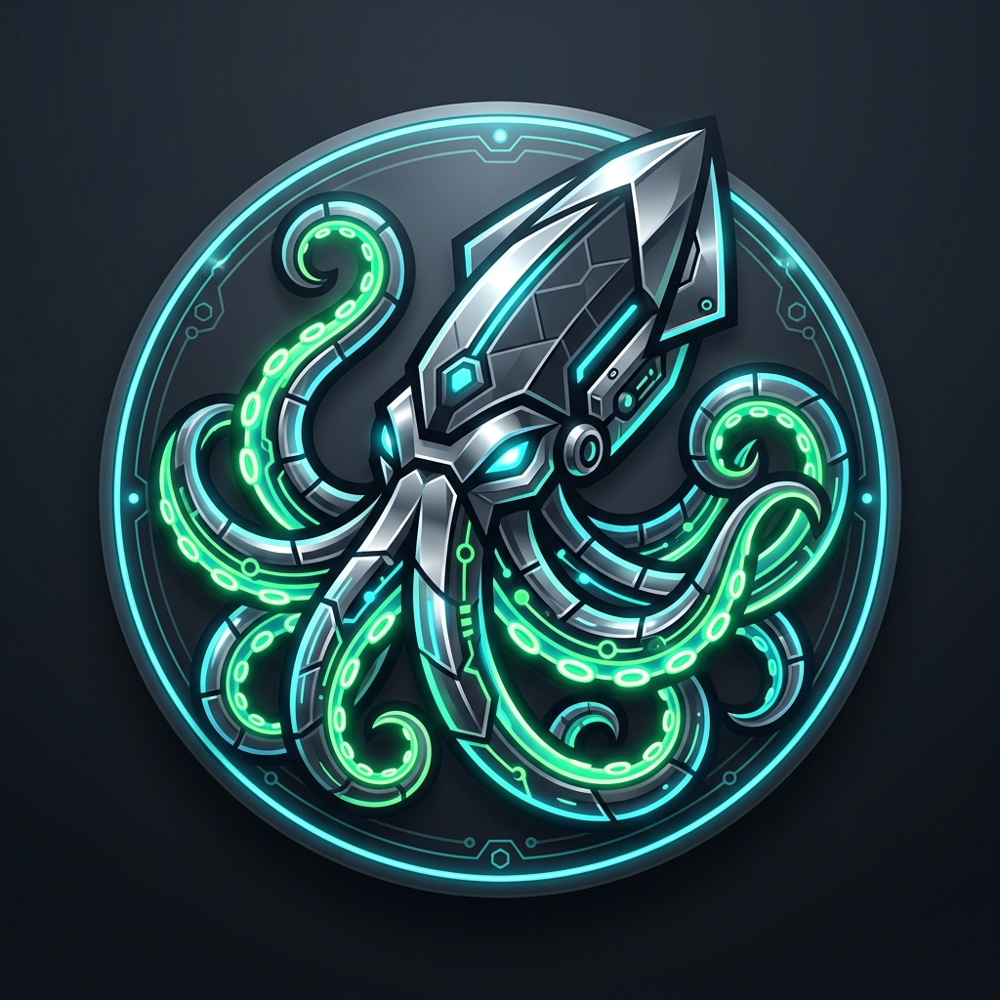
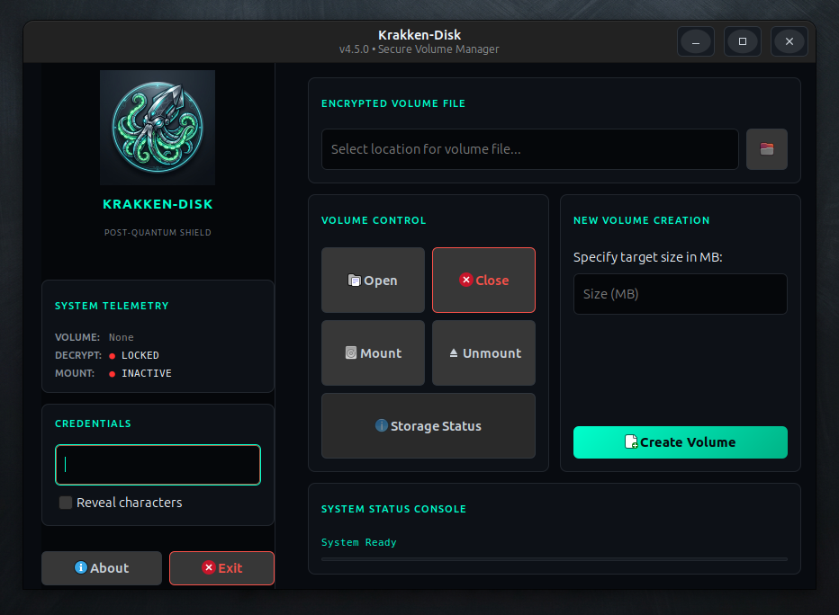
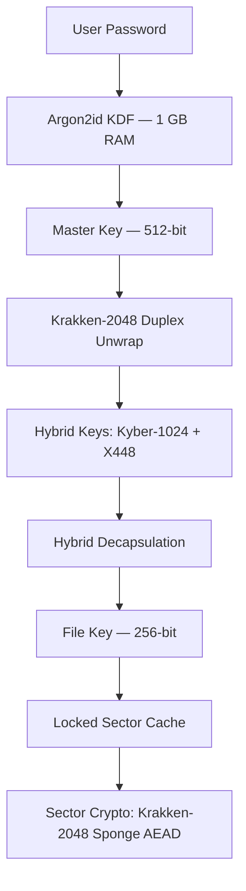

<div align="center">
  
</div>
<div align="center"><h1>
<a href="https://github.com/effjy/krakken-disk/"></a>
</h1>
</div>
<div align="center">
  
[](LICENSE)
[]()
[]()
[]()
[]()
[]()

</div>

## 📸 Screenshot

<div align="center">
  
  <br/>
  <em>Krakken-Disk dark-themed GTK interface — volume management for the post-quantum era</em>
</div>

---

**Krakken-Disk** is an ultra-secure, high-performance encrypted volume manager built for the post-quantum era. Powered by the 2048-bit **Krakken-2048 Abyssal** permutation, it delivers a uniform 256-bit security margin against both classical and quantum adversaries (post-Grover).

By intelligently combining lattice-based cryptography, elliptic curve hybrids, and AVX2-accelerated primitives, Krakken-Disk offers strong protection, plausible deniability, and exceptional speed on modern hardware.

---

## 🌌 Key Highlights

- 🛡️ **Post-Quantum Security** — Uniform 256-bit post-Grover margin across header and data layers using the 2048-bit Krakken permutation.
- 🧬 **Hybrid KEM** — Kyber-1024 (lattice-based) + X448 (elliptic curve) for master and file key protection.
- ⚡ **AVX2-Optimized Core** — Hand-tuned implementation of the Krakken-2048 permutation with full register-resident operations.
- 🌑 **Plausible Deniability** — IND-RND compliant volumes indistinguishable from random noise — no headers, signatures, or patterns.
- 🔒 **Anti-Brute-Force Design** — Argon2id with 1 GB memory hardness to defeat GPU/ASIC attacks.
- 🔄 **Backward Compatibility** — Seamless support for legacy V3 (XChaCha) and current V4 (Krakken-2048) volumes.
- 🐧 **FUSE 3 Integration** — Mounts encrypted containers as standard read-write filesystems.

---

## 🛠️ Cryptographic Architecture



### The Krakken-2048 Abyssal Permutation
A 2048-bit (32 × 64-bit) state organized as a 4×8 matrix, processed in 10 rounds:
- **Theta** — Column parity diffusion
- **Tentacle** — GF(2⁸) MDS matrix (branch number 9)
- **Rho & Pi** — Rotations and lane permutations
- **Chi** — Coupled nonlinear S-box layer
- **Pressure** — ARX carry-chain mixing
- **Beta/Iota** — SHAKE-128 derived round constants
- **Ink Cloud** — Global bit shuffle

### High-Performance AEAD
Streams are processed in 4 MB parallel segments using independent sponge instances. Each segment produces a keystream via `Krakken-Sponge(FileKey || Nonce || LE64(i))`, followed by BLAKE2b-256 authentication.

---

## 📋 Prerequisites

### Build Tools
- GCC (with AVX2 and C11 support)
- GNU Make
- pkg-config

### Required Libraries
- libsodium
- OpenSSL (for X448)
- FUSE 3 (`libfuse3-dev`)
- GTK 3/4 (for GUI)
- ncurses (CLI fallback)

**Debian/Ubuntu Installation:**
```bash
sudo apt update
sudo apt install build-essential pkg-config libsodium-dev libssl-dev libfuse3-dev libgtk-3-dev libncurses5-dev
```

---

## ⚙️ Compilation & Installation

```bash
# Validate dependencies
make check-deps

# Build optimized binary
make

# Install system-wide
sudo make install

# Uninstall
sudo make uninstall
```

Run with `make run` from the build directory or simply `krakken-disk` after installation.

---

## 🚀 How to Use

### Creating a Volume
1. Specify the output file path and desired size (10 MB – 1 TB).
2. Enter a strong passphrase.
3. Click **Create Volume**.

### Mounting a Volume
1. Select the encrypted container.
2. Enter your passphrase.
3. Click **Open** → **Mount** and choose a mount point.
4. Access the volume as a normal directory.
5. Click **Unmount** when finished to securely flush and close.

---

## 🔒 Security Best Practices

> [!WARNING]
> **Swap Partition Warning**  
> Krakken-Disk detects unencrypted swap space on startup. Disable swap (`sudo swapoff -a`) or encrypt it with LUKS to prevent key material leakage.

> [!IMPORTANT]
> **Memory Locking**  
> The application uses `sodium_mlock()` on all sensitive data. Run with sufficient `ulimit` or elevated privileges for full effectiveness.

---

## 🔗 Related Projects

- **[Krakken-2048 Abyssal](https://github.com/effjy/krakken)** — The core 2048-bit SPN-ARX permutation
- **[Virtual Wipe Turbo](https://github.com/effjy/vwipe)** — Forensic-grade data sanitization suite

---

## 👥 Author

**Jean-François Lachance-Caumartin**  
Lead Cryptographer & Developer

---

This project is licensed under the **MIT License**. See [LICENSE](LICENSE) for details.

*🦑 Released into the Abyss — 2026*
